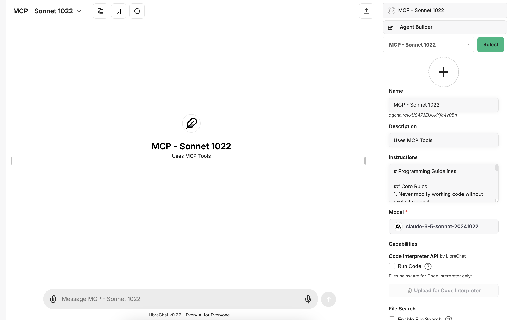

# Creating Your MCP-Using Agent

This guide explains how to create and configure an agent that uses MCP (Mission Control Protocol) capabilities in LibreChat.

## Setting Up an MCP Agent

1. **Access Agent Builder**
   - Click on the Agent Builder icon in LibreChat
   - Select "MCP - Sonnet 1022" or your preferred Claude model

2. **Configure Basic Settings**
   - **Name**: Give your agent a descriptive name
   - **Description**: Describe what your agent does
   - **Model**: Choose a Claude model with MCP support (e.g., claude-3-5-sonnet-20241022)

3. **Add Instructions**
   Your agent needs clear instructions about:
   - What tools it can use
   - When to use specific tools
   - How to handle errors
   - Any specific formatting requirements

4. **Configure Capabilities**
   - Enable relevant MCP tools:
     - WCGW for terminal operations
     - Fetch for web access
     - Brave Search for internet searches

## Creating Instructions in Agent Builder

When creating your MCP agent, you'll use the Agent Builder interface to set up your instructions:



Here's a template for effective agent instructions:

```
# Role
You are an assistant with access to various MCP tools. Your primary function is to [describe main purpose].

# Tool Usage Guidelines
1. Use WCGW for file and terminal operations
2. Use Fetch for accessing web content
3. Use Brave Search for internet searches

# Core Rules
1. Always verify tool availability before use
2. Handle errors gracefully
3. Provide clear feedback about tool operations
4. Protect sensitive information

# Workflow
1. Understand user request
2. Select appropriate tool(s)
3. Execute operations
4. Verify results
5. Provide clear feedback
```

## Best Practices

1. **Tool Selection**
   - Choose tools appropriate for the task
   - Avoid using multiple tools when one will suffice
   - Consider performance implications

2. **Error Handling**
   - Always check tool availability
   - Have fallback options ready
   - Provide clear error messages to users

3. **Security**
   - Never expose sensitive information
   - Validate inputs before using tools
   - Follow principle of least privilege

4. **Performance**
   - Use tools efficiently
   - Avoid unnecessary operations
   - Cache results when appropriate

## Testing Your Agent

1. **Basic Testing**
   - Verify each tool works as expected
   - Test error handling
   - Check response formatting

2. **Edge Cases**
   - Test with invalid inputs
   - Check timeout handling
   - Verify resource cleanup

3. **Integration Testing**
   - Test tool combinations
   - Verify workflow sequences
   - Check state management

## Common Issues and Solutions

1. **Tool Access Issues**
   - Verify tool configuration in librechat.yaml
   - Check API keys and permissions
   - Ensure tools are properly installed

2. **Response Formatting**
   - Use markdown for structured output
   - Follow consistent formatting
   - Include clear status indicators

3. **Performance Issues**
   - Minimize tool switching
   - Use appropriate timeouts
   - Monitor resource usage

## Maintaining Your Agent

1. **Regular Updates**
   - Keep tools updated
   - Review and update instructions
   - Monitor performance metrics

2. **Documentation**
   - Document tool usage patterns
   - Keep example commands updated
   - Document known limitations

3. **Version Control**
   - Track instruction changes
   - Document configuration updates
   - Maintain change history

## Advanced Features

1. **Chaining Tools**
   - Combine tools for complex operations
   - Handle intermediate results
   - Maintain state across operations

2. **Custom Functions**
   - Create reusable patterns
   - Standardize error handling
   - Optimize common operations

3. **Integration Patterns**
   - Work with external systems
   - Handle authentication
   - Manage sessions